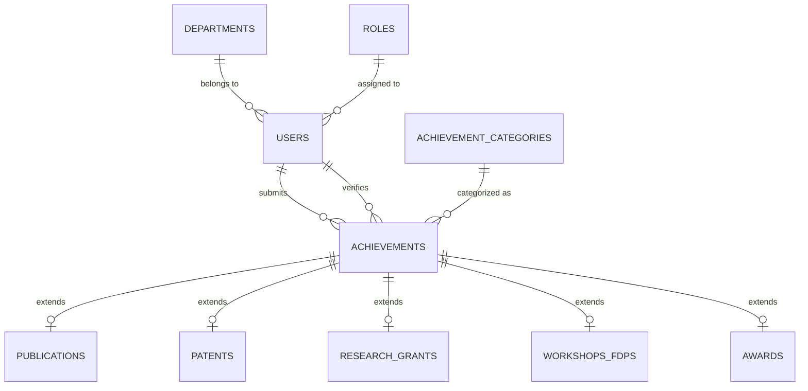

# Faculty Achievement Portal — Database Architecture & Specification

## 1. Overview
The database layer for the **Faculty Achievement Portal** is designed using MySQL 8.0+. It employs a hybrid **Table-Per-Subclass / Normalized Entity** pattern:

- **`achievements` (Master Table)**: Stores common metadata across all achievement types (faculty ID, title, date, academic year, status, proof URL, verification notes).
- **Sub-tables (`publications`, `patents`, `research_grants`, `workshops_fdps`, `awards`)**: Maintain 1-to-1 extension relationships with `achievements` to hold category-specific fields without bloating the core schema with nullable fields.

---

## 2. Entity Relationship Diagram (Conceptual Map)



---

## 3. Data Dictionary & Table Definitions

### 3.1 `departments`
Stores academic department classifications.
| Column | Type | Constraints | Description |
| :--- | :--- | :--- | :--- |
| `id` | `BIGINT` | PRIMARY KEY, AUTO_INCREMENT | Unique department ID |
| `code` | `VARCHAR(20)` | UNIQUE, NOT NULL | Short code (e.g. `CSE`, `ECE`) |
| `name` | `VARCHAR(100)` | NOT NULL | Full department name |
| `description` | `VARCHAR(255)` | NULL | Optional description |
| `created_at` | `DATETIME` | DEFAULT CURRENT_TIMESTAMP | Record creation timestamp |

### 3.2 `roles`
Defines access control security roles.
| Column | Type | Constraints | Description |
| :--- | :--- | :--- | :--- |
| `id` | `BIGINT` | PRIMARY KEY, AUTO_INCREMENT | Role ID |
| `name` | `VARCHAR(50)` | UNIQUE, NOT NULL | Role identifier (`ROLE_ADMIN`, `ROLE_HOD`, `ROLE_FACULTY`) |
| `description` | `VARCHAR(255)` | NULL | Role permissions summary |

### 3.3 `users`
Faculty, HOD, and Administrator user accounts.
| Column | Type | Constraints | Description |
| :--- | :--- | :--- | :--- |
| `id` | `BIGINT` | PRIMARY KEY, AUTO_INCREMENT | Unique user ID |
| `employee_id` | `VARCHAR(50)` | UNIQUE, NOT NULL | Staff / Employee Registration Code |
| `full_name` | `VARCHAR(100)` | NOT NULL | User's full name |
| `email` | `VARCHAR(100)` | UNIQUE, NOT NULL | Institutional email address |
| `password_hash` | `VARCHAR(255)` | NOT NULL | BCrypt hashed password |
| `designation` | `VARCHAR(100)` | NOT NULL | Assistant Professor, Professor, HOD, etc. |
| `department_id` | `BIGINT` | FK -> `departments.id` | Associated department |
| `role_id` | `BIGINT` | FK -> `roles.id` | Assigned security role |
| `phone` | `VARCHAR(20)` | NULL | Contact telephone number |
| `status` | `ENUM` | `ACTIVE`, `INACTIVE`, `SUSPENDED` | User account lifecycle status |

### 3.4 `achievements` (Master Entity)
Central registry for all submitted faculty achievements.
| Column | Type | Constraints | Description |
| :--- | :--- | :--- | :--- |
| `id` | `BIGINT` | PRIMARY KEY, AUTO_INCREMENT | Achievement Record ID |
| `user_id` | `BIGINT` | FK -> `users.id` | Faculty member who submitted |
| `category_id` | `BIGINT` | FK -> `achievement_categories.id` | Achievement category |
| `title` | `VARCHAR(255)` | NOT NULL | Achievement title / subject |
| `description` | `TEXT` | NULL | Detailed narrative or summary |
| `achievement_date` | `DATE` | NOT NULL | Date of achievement / event |
| `academic_year` | `VARCHAR(20)` | NOT NULL | Academic session (e.g. `2024-2025`) |
| `status` | `ENUM` | `PENDING`, `APPROVED`, `REJECTED` | Verification lifecycle state |
| `verification_comment` | `TEXT` | NULL | Notes from HOD/Admin reviewer |
| `verified_by_user_id` | `BIGINT` | FK -> `users.id` | HOD or Admin user who verified |
| `verified_at` | `DATETIME` | NULL | Verification timestamp |
| `proof_document_url` | `VARCHAR(500)` | NULL | Link/path to certificate or proof file |

### 3.5 Specialized Extension Tables

1. **`publications`**: Tracks journals, conference papers, indexing (`SCOPUS`, `WEB_OF_SCIENCE`, `UGC_CARE`), DOI, impact factor.
2. **`patents`**: Tracks patent application status (`FILED`, `PUBLISHED`, `GRANTED`), patent number, filing date, grant date.
3. **`research_grants`**: Tracks funding agencies, project titles, sanction amounts, project type (`RESEARCH`, `CONSULTANCY`, `INFRASTRUCTURE`).
4. **`workshops_fdps`**: Tracks event types (`FDP`, `WORKSHOP`, `SEMINAR`), role (`ATTENDED`, `ORGANIZED`, `RESOURCE_PERSON`), duration.
5. **`awards`**: Tracks honors, awarding bodies, and scope (`NATIONAL`, `INTERNATIONAL`, `STATE`, `INSTITUTIONAL`).

---

## 4. Execution & Setup Instructions

### Option A: Using MySQL Command Line Client (PowerShell)
Execute the DDL script using the `mysql` CLI tool:

```powershell
& "C:\Program Files\MySQL\MySQL Server 8.0\bin\mysql.exe" -u root -p < docs/schema.sql
```

### Option B: Using MySQL Workbench
1. Open **MySQL Workbench** and connect to your local MySQL instance (`localhost:3306`).
2. Navigate to **File -> Open SQL Script...** and select [`docs/schema.sql`](file:///c:/Users/vishw/Desktop/Faculty/faculty-achievement-portal/docs/schema.sql).
3. Click the **Execute (Lightning Bolt)** button to execute the full script.
4. Verify that `faculty_achievement_db` appears under **Schemas** with all 10 tables created.

---

## 5. Status
- **Step 2 Completed**: Database schema defined, normalized SQL DDL script created, and architecture documented.
- **Do NOT proceed to Step 3** until requested by the user.
