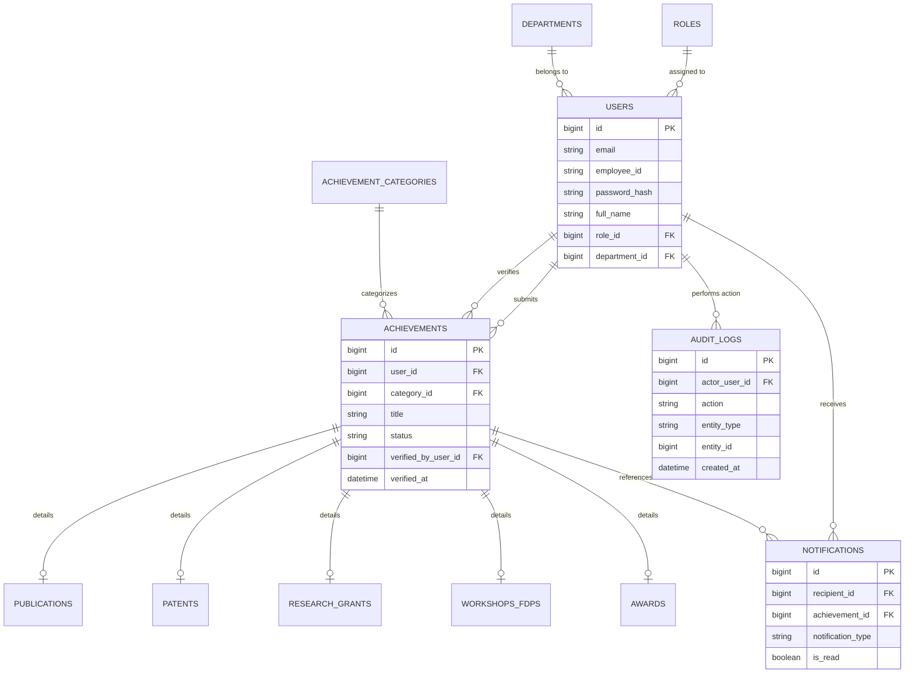

# Entity-Relationship (ER) Diagram Specification

**Institution**: Noida Institute of Engineering and Technology (NIET)  

---

## 1. Entity-Relationship Conceptual Model

---

## 2. Cardinality Rules

1. **User to Role**: Many-to-One (`USERS.role_id` -> `ROLES.id`). Each user has exactly one role.
2. **User to Department**: Many-to-One (`USERS.department_id` -> `DEPARTMENTS.id`).
3. **User to Achievements**: One-to-Many (`ACHIEVEMENTS.user_id` -> `USERS.id`). A faculty member can submit multiple achievements.
4. **Achievement to Verification**: Many-to-One (`ACHIEVEMENTS.verified_by_user_id` -> `USERS.id`).
5. **Achievement to Sub-Category Details**: One-to-One optional mapping with `publications`, `patents`, `research_grants`, `workshops_fdps`, and `awards`.
6. **User to Notifications**: One-to-Many (`NOTIFICATIONS.recipient_id` -> `USERS.id`).
7. **User to Audit Logs**: One-to-Many (`AUDIT_LOGS.actor_user_id` -> `USERS.id`).
